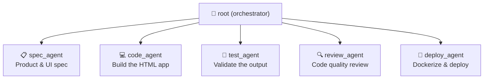

# Multi-Agent Swag Store

Now you'll run the **multi-agent** version of the same Swag Store. Instead of one agent doing everything, a **root orchestrator** delegates to **5 specialized sub-agents** — each with a distinct role.

---

## The agent pipeline



---

## What each agent does

| Agent | Role | Toolsets |
|---|---|---|
| `root` | Orchestrates and delegates | `todo`, `think` |
| `spec_agent` | Writes `spec.md` with brand, products, and UI spec | `filesystem`, `todo` |
| `code_agent` | Reads spec, writes the complete `index.html` | `filesystem`, `todo`, `shell` |
| `test_agent` | Validates HTML, writes `test-report.md` | `filesystem`, `todo` |
| `review_agent` | Reviews quality, writes `review-report.md` | `filesystem`, `todo`, `think` |
| `deploy_agent` | Writes Dockerfile, builds image, deploys | `filesystem`, `shell`, `todo` |

---

## Run the multi-agent store

> [!IMPORTANT]
> Stop any existing container on port 8080 first:
> ```bash
> docker rm -f swag-store weather-dashboard 2>/dev/null; true
> ```

1. Change into the multi-agent directory:

    ```bash
    cd swag-store/multi-agent
    ```

2. Launch the agent pipeline:

    ```bash
    docker agent run docker-agent.yaml "Build and deploy a Docker-branded Swag Store. Create a product spec, build a complete single HTML file with 8 products, shopping cart, category filters and toast notifications using Docker brand colors #1D63ED and #030F1C, validate all components, review code quality, then Dockerize with nginx:alpine and deploy to port 8080. Keep the container running after deployment."
    ```

3. When you see the final success message, open the store:

    ::tabLink[Open Swag Store (Multi-Agent)]{href="http://localhost:8080" title="App" id="app"}

---

## Inspect the agent artifacts

```bash
ls ../../swag-store/
```

You'll find `spec.md`, `index.html`, `test-report.md`, `review-report.md`, and `Dockerfile`.

```bash
cat ../../swag-store/test-report.md
```

```bash
cat ../../swag-store/review-report.md
```

---

## Single vs Multi: what's the difference?

| | Single-Agent | Multi-Agent |
|---|---|---|
| Agents | 1 | 5 |
| Specialization | Generalist | Each agent is an expert |
| Artifacts | `index.html`, `Dockerfile` | `spec.md`, `index.html`, `test-report.md`, `review-report.md`, `Dockerfile` |
| Use case | Simple tasks, fast execution | Complex tasks needing validation and review gates |

> [!TIP]
> Go back up before the final section:
> ```bash
> cd ../..
> ```
